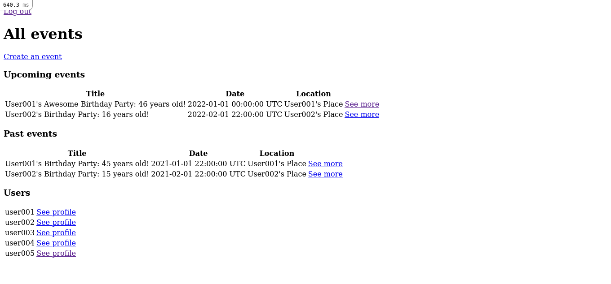
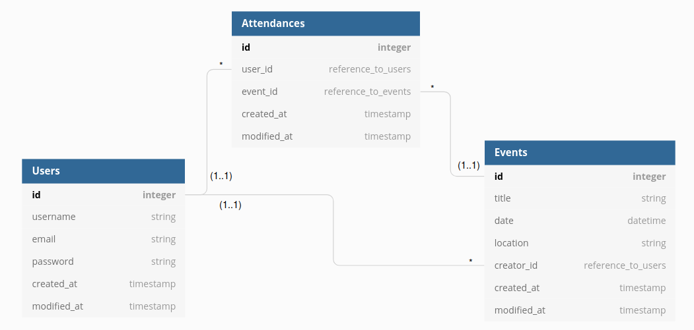

# Private Events

> This is part of the Members Only Project of The Odin Project’s Ruby on Rails Curriculum, which is also part of Microvese's Technical Curriculum. To make it, we followed [these tutorial instructions](https://www.theodinproject.com/paths/full-stack-ruby-on-rails/courses/ruby-on-rails/lessons/associations).



In this project we built a site similar to a private Eventbrite which allows users to create events and then manage user signups. Users can create events and send invitations to parties. Events take place at a specific date and at a location.

For this project, we learned about Associations and how to perform Tests in Rails (_unit tests_ for models associations and validations and _integrations tests_ for authentication and events managment) using Capybara to control Selenium on Chrome Webdriver and RSpec.

## Built With

- Ruby 3.0.1
- Rails 6.1.3.2 (Ruby Gem)
- Sqlite 1.4.2 (Ruby Gem)
- Devise 4.8 (Ruby Gem)
- rspec-rails 5.0 (Ruby Gem)
- capybara 3.26 (Ruby Gem)

## Getting Started

To get a local copy up and running, please follow these steps:

### Prerequisites

For this project, the following environment should be previously installed on your machine:

- Ruby 3.0.1
- Rails 6.1.3.2
- Node 14.17.0
- Yarn 1.22.10

### Setup

- Go to your terminal bash and, on any directory of your preference, run

```sh
git clone git@github.com:enionsouza/private-events.git
```

- Next, run `$ cd private-events` to go into the project root directory.
- Run `$ bundle install` to install all Ruby Gems this project requires.
- And, finally, to prevent any issue that might eventually come up because of webpacker package, run

```sh
rails webpacker:install
```

### Install

- Run `$ rails db:migrate` to migrate the databases needed to run this project.
- Run `$ rails db:seed` to load some record samples for Users and Events Tables and also for Creators and Attendees Tables (which are auxiliary tables to this project). By doing this, you should get 4 sample users and 4 sample events (with some attendees, each). The following users are provided, out of the box:
  | username | email | password |
  |----------|---------------------|----------|
  | user001 | user001@example.com | Secret1 |
  | user002 | user002@example.com | Secret1 |
  | user003 | user003@example.com | Secret1 |
  | user004 | user004@example.com | Secret1 |

- Run `$ rails server` to start your local host. You can stop your local server pressing `<ctrl> + c` on your keyboard.
- On the browser of your preference, you can go to http://127.0.0.1:3000/ and you should be able to see the home page which shows all the events. Now, you can either "Sign in" with one of the previously added users (see list above) or you can "Sign up" with a new user with the "Sign Up" link.

_Important: Please, note that the validations presented below should be taken into account._

- Notice that when you are not logged in, you cannot see more details about the events!

        Users
          has_many :events
          has_many :attended_events
          - username:string
          - email:string
          - password:string

        Events
          belongs_to :creator
          has_many :attendees
          - title:string
          - date:datetime
          - location:string
          - creator:references

        Attendances
          belongs_to :users
          belongs_to :events
          - event:references
          - user:references

  

### Tests

- Please, make sure that your computer has Google Chrome installed, before performing these tests.
- On the root of the project, run

```sh
$ rails db:migrate RAILS_ENV=test
$ rspec
```
Some of the tests are run by Capybara, so you'll see a Chrome tab flashing through pieces of the web application. This is a bot running tests as if it were a user. Don't try to close this window.

## Authors

👤 **Julian Carracedo**

- GitHub: [@JuliCarracedo](https://github.com/JuliCarracedo)
- Twitter: [@CarracedoTrigo](https://twitter.com/CarracedoTrigo)
- LinkedIn: [Julian Carracedo](https://www.linkedin.com/in/julian-carracedo/)

👤 **Ênio Neves de Souza**

- GitHub: [@enionsouza](https://github.com/enionsouza)
- Twitter: [@enionsouza](https://twitter.com/enionsouza)
- LinkedIn: [Enio Neves de Souza](https://www.linkedin.com/in/enio-neves-de-souza/)

## 🤝 Contributing

Contributions, issues, and feature requests are welcome!

Feel free to check the [issues page](https://github.com/enionsouza/private-events/issues).

## Show your support

Give a ⭐️ if you like this project!

## Acknowledgments

- [Microverse](https://www.microverse.org/)
- [The Odin Project](https://www.theodinproject.com/)
- [Rails Guides](https://guides.rubyonrails.org/index.html)

## 📝 License

This project is [MIT](./LICENSE) licensed.
